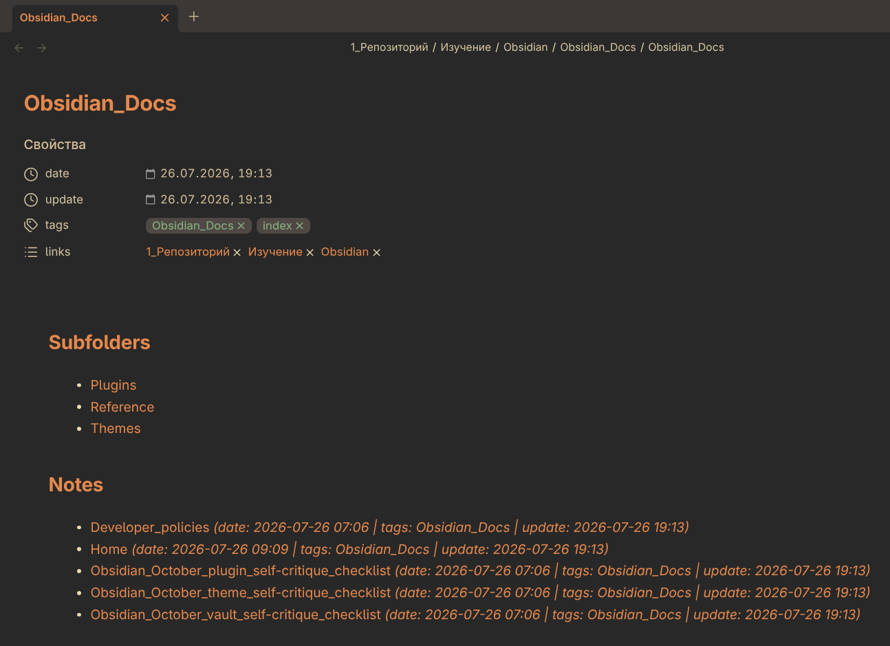

# ORDupdater

> Automatically manages frontmatter properties based on folder structure. Creates and maintains folder index files.



## Features

| Capability | What it does |
|------------|--------------|
| **Auto-tags** | Adds a tag from the parent folder name |
| **Auto-links** | Adds wikilinks to all ancestor folders |
| **Date tracking** | Sets `date` on first update, `update` on every change |
| **Folder index** | Creates `Folder.md` files listing subfolders and notes |
| **I18n** | Interface adapts to Obsidian language (EN / RU) |
| **Batch mode** | Processes 20 files in parallel for large vaults |
| **Safe** | Skips hidden folders (`.obsidian`, `.git`), Excalidraw, and index files |

### Optional

| Feature | Default | Description |
|---------|---------|-------------|
| Lock properties | OFF | Hides the "Add property" button and tag delete buttons |
| Sanitize spaces | OFF | Renames files/folders with spaces (`My File.md` → `My_File.md`) |
| Overwrite mode | OFF | Strips non-standard frontmatter fields |

## Installation

**Community plugins:**
1. Settings → Community plugins → Browse → **ORDupdater**
2. Install & Enable

**Manual:**
Copy `main.js`, `manifest.json`, `styles.css` to `.obsidian/plugins/ord-updater/`.

## Usage

| Action | What happens |
|--------|-------------|
| **Auto** (create/edit/rename) | Frontmatter is updated automatically |
| **Ribbon icon** (sidebar) | Updates all files + folder indices |
| **Right-click** a folder | Updates all files in folder + indices |
| **Right-click** a file | Updates single file |
| **Command palette** | "Update all files" / "Update current file" |

## Settings

| Setting | Description |
|---------|-------------|
| Auto-update | Update frontmatter on file create/modify/rename |
| Auto-tags | Tag from folder name |
| Auto-links | Backlinks to parent folders |
| Folder index | Create/update `Folder.md` |
| Index on save | Update folder index on Ctrl+S |
| Lock properties | Hide "+" button and tag remove buttons |
| Overwrite mode | Strip non-standard fields (forces Auto-tags, Auto-links, Lock) |
| Sanitize spaces | Rename files/folders with spaces |

## Frontmatter example

```yaml
---
date: 2026-07-26
update: 2026-07-26 14:30
tags:
  - "Ideas"
links:
  - "[[Notes]]"
  - "[[1_Repository]]"
---
```

## Folder index example

`Notes/Ideas/Ideas.md` is automatically created with:

```yaml
---
tags:
  - "Ideas"
  - "index"
links:
  - "[[Notes]]"
  - "[[1_Repository]]"
---

## Notes

- [[TraiderBot]] _(date: 2026-07-22 | tags: Ideas | update: 2026-07-26)_
```

## Development

```bash
git clone https://github.com/Ordnungen/ord-updater
cd ord-updater
npm install
npm run dev    # watch mode
npm run build  # production build
```

## License

MIT
