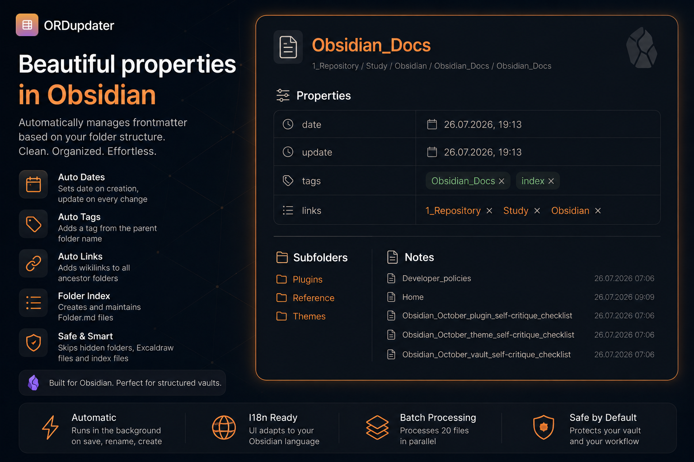

# ORDupdater

*Automatically manages frontmatter properties based on folder structure. Creates and maintains folder index files.*



## Features

| Capability | What it does |
|------------|--------------|
| Auto-tags | Adds a tag from the parent folder name |
| Auto-links | Adds wikilinks to all ancestor folders |
| Date tracking | Sets date on first update, update on every change |
| Folder index | Creates Folder.md files listing subfolders and notes |
| I18n | Interface adapts to Obsidian language (EN / RU) |
| Batch mode | Processes 20 files in parallel for large vaults |
| Safe | Skips hidden folders (.obsidian, .git), Excalidraw, and index files |

### Optional

| Feature | Default | Description |
|---------|---------|-------------|
| Lock properties | OFF | Hides the Add property button and tag delete buttons |
| Sanitize spaces | OFF | Renames files/folders with spaces |
| Overwrite mode | OFF | Strips non-standard frontmatter fields |

## Installation

Settings → Community plugins → Browse → ORDupdater → Install & Enable

Manual: copy main.js, manifest.json, styles.css to .obsidian/plugins/ord-updater/

## Usage

| Action | What happens |
|--------|-------------|
| Auto (create/edit/rename) | Frontmatter is updated automatically |
| Ribbon icon (sidebar) | Updates all files + folder indices |
| Right-click a folder | Updates all files in folder + indices |
| Command palette | Update all files / Update current file |

## Settings

| Setting | Description |
|---------|-------------|
| Auto-update | Update frontmatter on file create/modify/rename |
| Auto-tags | Tag from folder name |
| Auto-links | Backlinks to parent folders |
| Folder index | Create/update Folder.md |
| Index on save | Update folder index on Ctrl+S |
| Lock properties | Hide plus button and tag remove buttons |
| Overwrite mode | Strip non-standard fields |
| Sanitize spaces | Rename files/folders with spaces |

## Development

```bash
git clone https://github.com/Ordnungen/ord-updater
cd ord-updater
npm install
npm run dev
npm run build
```

## License

MIT
