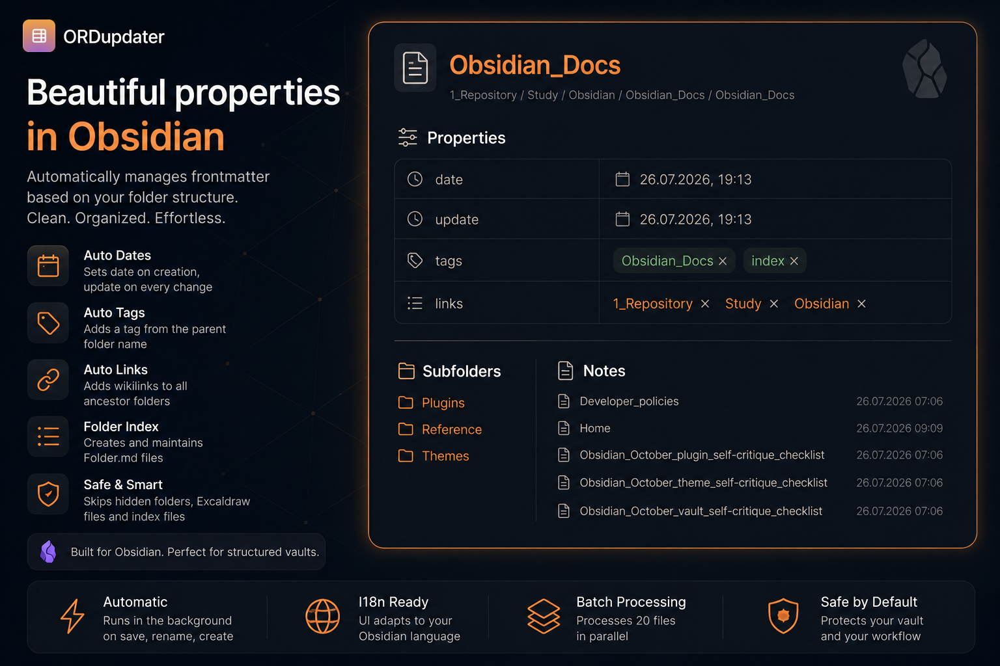

# ORDupdater

*Keeps frontmatter properties and folder index notes in sync with your folder structure.*



## What it does

| What | How |
|------|-----|
| Section chain | Every note gets `links:` — wikilinks to the folders it lives in, from the top down. Links you wrote yourself stay |
| Dates | `date` is set once, when the note first gets properties. `update` moves only when the note or its properties really changed |
| Folder tag | `tags` gets the tag of the folder the note is in. Your own tags stay |
| Folder index | Every folder gets `<Folder>.md` listing its subfolders and notes with their dates and tags |
| Renaming | With "Remove spaces in names" on, files and folders with spaces are renamed through Obsidian, so links to them follow |
| Moving a note | The chain and the tag of the old folder are removed; everything you wrote stays |

Hidden folders (`.obsidian`, `.git`, …) are never touched, and nothing is written outside your vault.

## Settings

| Setting | Default | What it does |
|---------|---------|--------------|
| Auto-update | ON | Update properties on file create, modify and rename |
| Auto-tags | ON | Add the folder tag to `tags` |
| Auto-links | ON | Add the chain of folders to `links` |
| Folder index | ON | Create and update `<Folder>.md` |
| Update index on save | ON | Refresh the folder index after a note changes |
| Lock properties | OFF | Hide "Add property" and the tag remove buttons |
| Skip names | `node_modules, src, dist, build, README.md` | Folders and notes with these names are left alone. Comma separated, case does not matter, hidden folders are always skipped |
| Overwrite mode | OFF | Keep only `date`, `update`, `tags` and `links` and remove the other properties |
| Remove spaces in names | OFF | Rename files and folders with spaces, links included |

The interface follows the language of Obsidian (English and Russian are included).


## Performance

Notes are processed in batches of 20, and only when something really has to change: a second run over untouched
notes writes nothing at all. Folder indexes are built from Obsidian's own metadata cache, so note contents are
not read for that.

## Data and privacy

Only the notes in your vault and the plugin's own `data.json` are used. Nothing is sent anywhere, and no note is
rewritten unless its properties need it.

## Installation

- Community plugins → Browse → ORDupdater → Install & Enable
- Manual: copy `main.js`, `manifest.json`, `styles.css` to `.obsidian/plugins/ord-updater/`

## Development

```bash
git clone https://github.com/Ordnungen/ord-updater
cd ord-updater
npm install
npm run dev      # watch build
npm run check    # typecheck + lint
npm run cases    # checks on an Obsidian stub
npm run dry-run -- "<vault>"   # what the plugin would change, without writing anything
npm run build    # production build
```

## License

MIT
